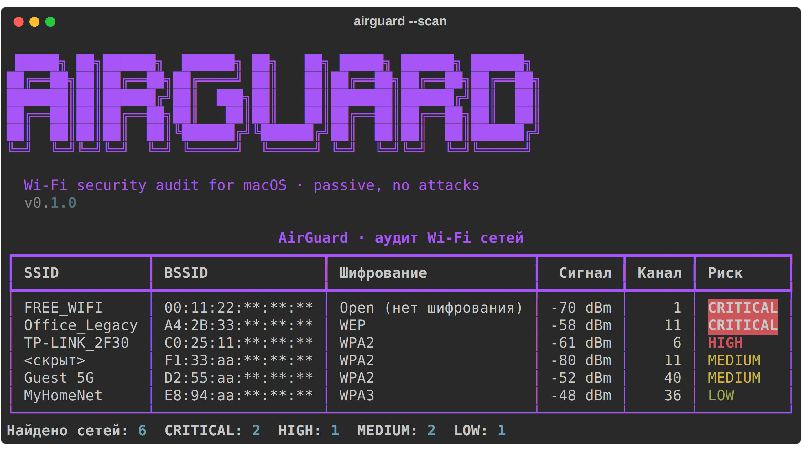

# airguard

Утилита для аудита защищённости Wi-Fi сетей под macOS.

Смотрит, какие сети есть вокруг, проверяет их защиту (тип шифрования,
заводские имена, скрытые сети) и показывает, где есть риск — в терминале
и в виде HTML-отчёта. Работает только пассивно, ничего не ломает и не
подключается к чужим сетям.



## Установка

```bash
git clone https://github.com/Lottersss/airguard.git
cd airguard
./install.sh
```

## Запуск

```bash
source .venv/bin/activate
airguard --scan --report report.html
```

Лицензия MIT.
